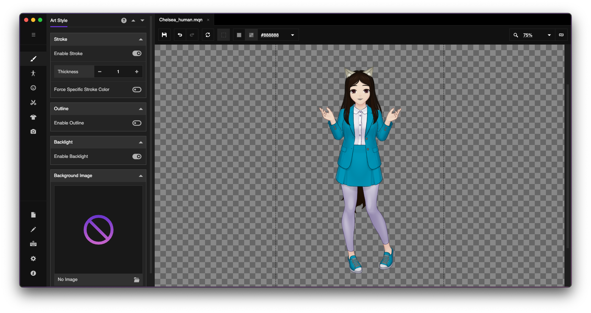

# Bushy Tail Addon for Mannequin

The **Bushy Tail** addon is a DLC package for the [Mannqeuin doftware][mq] that
gives characters a bushy tail. This may be useful for characters which have more
animal-like qualities such as tails and fox ears.

This addon is used internally to generate the portraits for Chelsea Roslyn in
_Indexing Your Heart_.

## Installation

Clone the repository using `git clone` or `gh repo clone` to the directory where
you want to install DLCs for Mannequin to. Then, follow the instructions provided
in the Mannequin documentation to install a DLC at
https://ar14.works/docs/installing-mods.

## License
The source code and corresponding vector graphics are licensed under the Mozilla
Public License, v2.0. You can read your rights in the LICENSE file or by visiting
http://mozilla.org/MPL/2.0/.

[mq]: https://ar14.itch.io/mannequin

